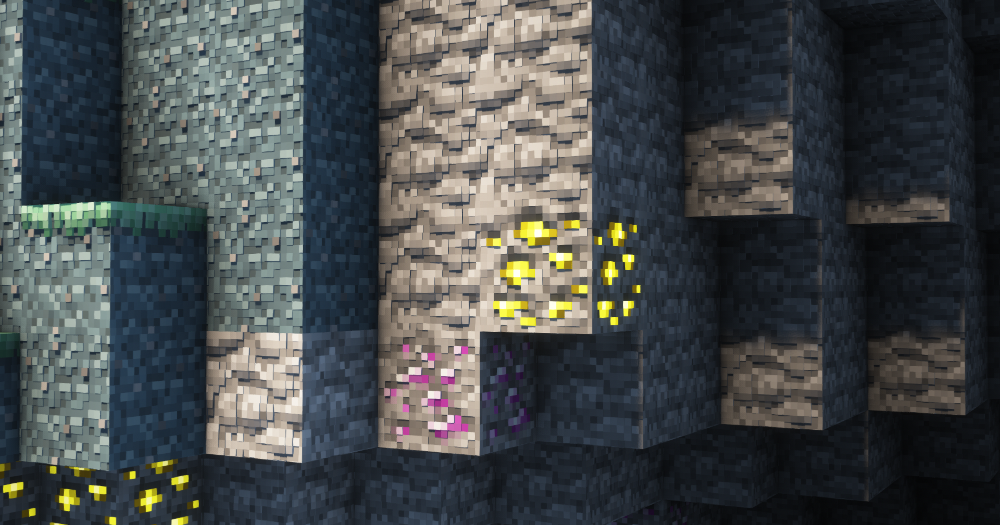

# Aether PBR

  
PBR Resource pack for [The Aether](https://modrinth.com/mod/aether) mod

 

> Based on extensive testing in various scenarios, [Complementary](https://www.complementary.dev/) has proven to be the best shader for running PBR with minimal bugs.  
While the screenshots were taken using **Sundial** and **Bliss** together, it is recommended to use **Complementary** for gameplay.

 

## Screenshots

